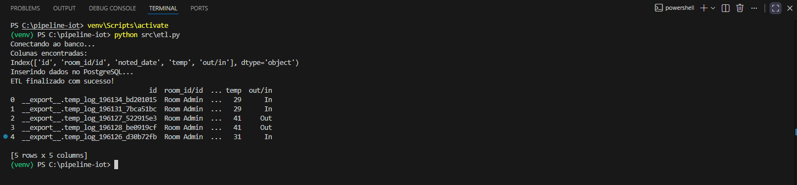
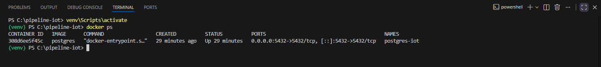
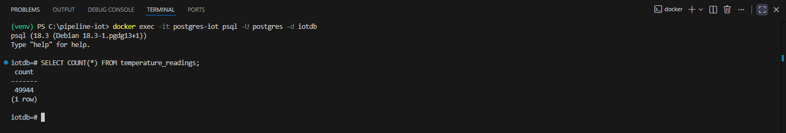
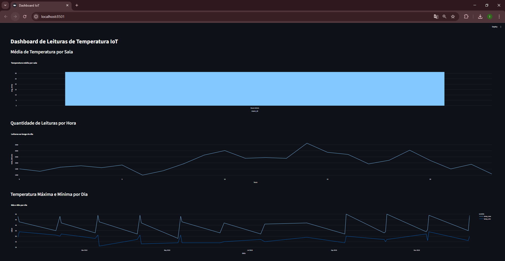
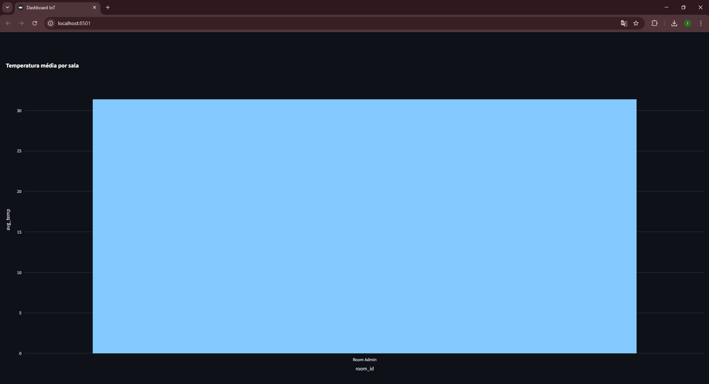
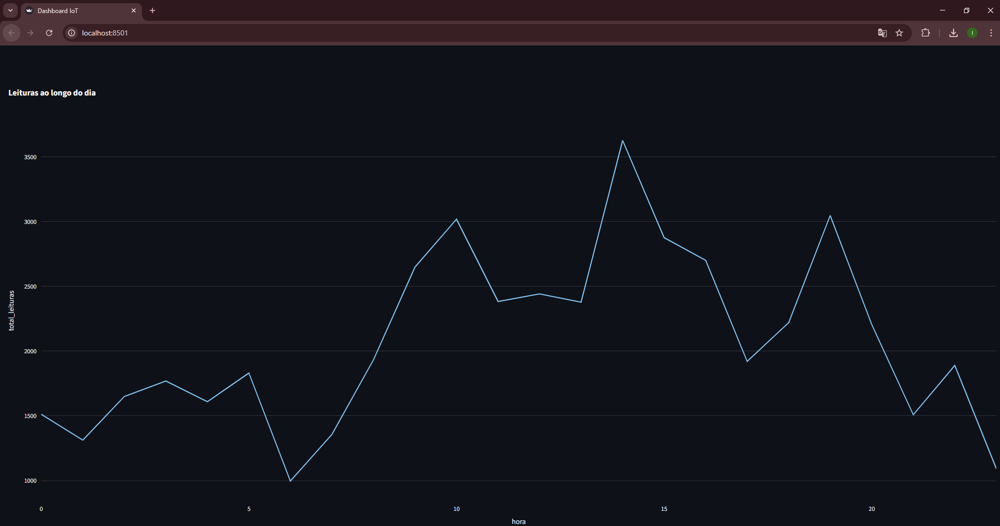
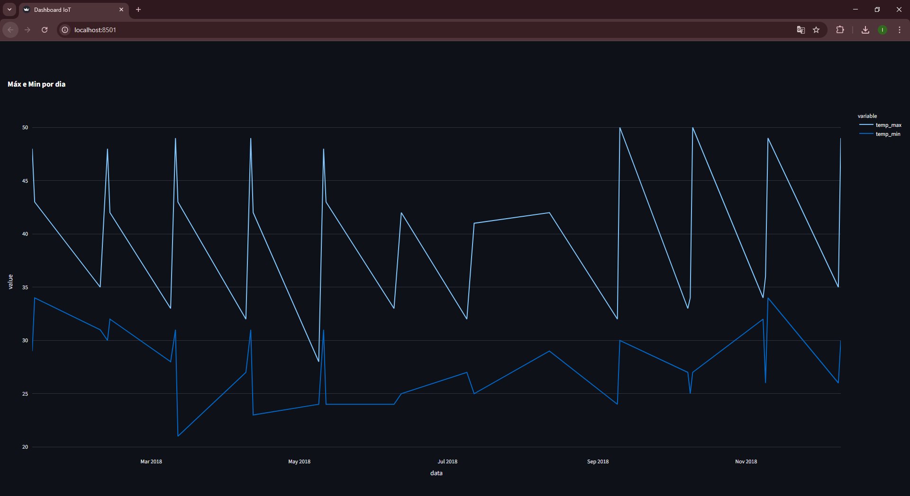

# IoT Data Pipeline

Pipeline de dados para processamento e visualização de leituras de sensores IoT utilizando **Python, PostgreSQL, Docker e Streamlit**.

---

# Objetivo

Este projeto demonstra a construção de um **pipeline de dados completo**, responsável por:

* Ingestão de dados de sensores IoT
* Processamento e limpeza dos dados
* Armazenamento em banco PostgreSQL
* Criação de views analíticas
* Visualização interativa dos dados

---

# Arquitetura da solução

Fluxo do pipeline:

CSV Dataset → Python ETL → PostgreSQL (Docker) → SQL Views → Streamlit Dashboard

Etapas:

1. Dataset CSV contendo leituras de sensores de temperatura
2. ETL em Python responsável por tratar e carregar os dados
3. Banco PostgreSQL executando em container Docker
4. Views SQL para agregações analíticas
5. Dashboard Streamlit para visualização dos dados

---

# Tecnologias utilizadas

* Python
* Pandas
* SQLAlchemy
* PostgreSQL
* Docker
* Streamlit
* Plotly

---

# Estrutura do projeto

iot-data-pipeline
```bash
data
└── IOT-temp.csv
docs
└── imagens
sql
└── create_views.sql
src
├── etl.py
└── dashboard.py
requirements.txt
.gitignore
README.md
```
---

# Execução do projeto

## 1 Clonar o repositório
```bash
git clone https://github.com/igor-rgomes/iot-data-pipeline.git
cd iot-data-pipeline
```
---

## 2 Criar ambiente virtual
```bash
python -m venv venv
```
Ativar ambiente virtual
Windows
```bash
venv\Scripts\activate
```
Linux / Mac
```bash
source venv/bin/activate
```
---

## 3 Instalar dependências
```bash
pip install -r requirements.txt
```
---

## 4 Subir PostgreSQL com Docker
```bash
docker run --name postgres-iot -e POSTGRES_USER=postgres -e POSTGRES_PASSWORD=123456 -e POSTGRES_DB=iotdb -p 5432:5432 -d postgres
```
---

## 5 Executar pipeline ETL
```bash
python src/etl.py
```
O ETL realiza:
* leitura do CSV
* limpeza e padronização dos dados
* inserção no banco PostgreSQL

---

## 6 Criar views analíticas
```bash
docker exec -it postgres-iot psql -U postgres -d iotdb
```
Executar o script SQL
```bash
\i sql/create_views.sql
```
---

## 7 Executar dashboard
```bash
streamlit run src/dashboard.py
```
O dashboard exibirá visualizações como:

* temperatura média por sala
* leituras por hora
* temperaturas máximas e mínimas por dia

---

# Evidências do funcionamento

Execução do ETL



---

Container PostgreSQL no Docker



---

Consulta SQL no banco



---

Dashboard completo



---

Temperatura média por sala



---

Leituras por hora



---

Temperatura máxima e mínima por dia



---

# Resultados

O pipeline permite:

* ingestão automatizada de dados IoT
* armazenamento estruturado
* geração de métricas analíticas
* visualização interativa dos dados

Esse tipo de arquitetura é amplamente utilizado em cenários de:

* monitoramento de sensores
* cidades inteligentes
* indústria 4.0
* análise de dados em tempo real

---

# Autor

Igor Gomes
